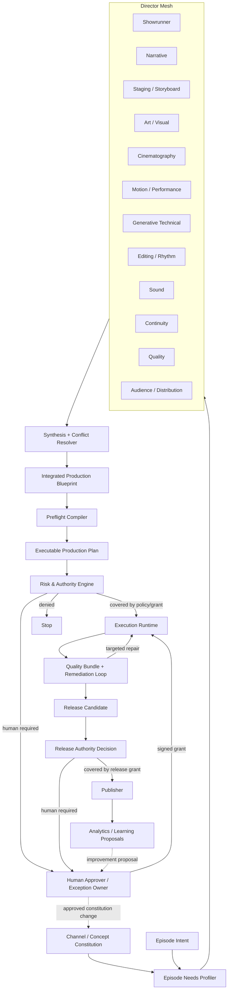

# video-production-core 개편 설계안 v1

## 0. 결론

세 가지 요구를 각각 별도 기능으로 덧붙이면 시스템은 더 복잡해진다. 특히 현행 직렬 파이프라인의 각 단계 앞뒤에 “전문 감독 에이전트”를 추가하면 문서 수, 검토 수, 대기 시간이 모두 증가한다.

권장 구조는 다음 세 축을 한 번에 바꾸는 것이다.

1. **Director Mesh**: 각 전문 감독은 순차 단계가 아니라 하나의 통합 제작 설계도를 병렬로 설계·검증한다.
2. **Integrated Production Blueprint**: brief, storyboard, generation packet, edit plan, sound plan을 각각 독립된 진실의 원천으로 두지 않고 하나의 제작 설계도를 권위 있는 원본으로 둔다.
3. **Risk-based Authority Control**: 사람은 저수준 제작 작업자가 아니라 장기 정책의 승인자, 고위험 행동의 권한 부여자, 예외 처리자로만 개입한다.

핵심 운영 목표는 다음과 같다.

- 정규 에피소드의 사람 개입: 초기 운영에서는 1회 이하, 안정화 후에는 에피소드별 0회 가능
- 공개·비용·정책 예외 등 위험한 행동: 암묵 승인 없이 정확한 해시와 범위에 결합된 엄격한 승인
- 감독 수 증가에 따른 절차 증가: 금지
- 하나의 변경으로 영향받지 않은 단계까지 재실행: 금지
- AI 검토 결과를 인간 승인으로 간주: 금지

---

## 1. 현행 구조에서 직접 제거해야 할 병목

현재 `engine/orchestration.py`의 생산 경로는 대략 다음 순서를 가진다.

```text
brief
→ storyboard
→ storyboard review
→ storyboard approval
→ generation packet
→ packet review
→ feasibility review
→ generation approval
→ external generation
→ shot QC
→ continuity QC
→ candidate ranking
→ human edit selection
→ rough cut
→ final delivery
→ final review
→ publish metadata
→ publish approval
→ human publish
```

특히 다음 구조가 사람 개입과 절차를 고정한다.

- `hash_binding_required=True`이면 storyboard 인간 승인이 추가된다.
- generation approval과 publish approval이 별도로 존재한다.
- `candidate-ranking/1.0`은 자동 선택을 금지한다.
- `edit-manifest/1.0`은 `selected_by_human`을 필수로 한다.
- 외부 생성과 게시 역시 인간 또는 채널 도구에 다시 넘긴다.

즉 Standard/Controlled 경로에서는 실질적으로 storyboard 승인, generation 승인, 클립 선택, publish 승인뿐 아니라 외부 실행까지 사람에게 의존할 수 있다.

### 개편 원칙

- 검토가 필요하다는 사실과 별도 artifact가 필요하다는 사실을 동일시하지 않는다.
- 전문 감독을 독립된 직렬 단계로 만들지 않는다.
- 계획 문서와 실행 문서의 중복을 없앤다.
- 사람의 판단이 필요하지 않은 선택을 인간 전용 스키마로 강제하지 않는다.
- 승인은 artifact의 boolean 속성이 아니라 특정 행동에 대한 외부 권한 증거로 모델링한다.

---

## 2. 목표 시스템 구조



이 구조는 네 개의 논리 평면으로 나눈다.

- **설계 평면**: Director Mesh, Production Blueprint
- **통제 평면**: evidence, workflow, policy, risk, authority
- **실행 평면**: generation, edit, sound, encode, publish adapter
- **학습 평면**: 성과 데이터와 개선 제안. 자동으로 헌법·정책을 변경하지는 않는다.

---

## 3. 전문 감독 체계: Director Mesh

### 3.1 가장 중요한 규칙

전문 감독 12명을 12개의 순차 단계로 구현하지 않는다. 모든 감독은 같은 `ProductionBlueprint`에 대해 자신의 소유 영역만 병렬로 분석하고 구조화된 patch와 assessment를 제출한다.

여기서 **감독은 논리적 책임과 검증 계약**을 뜻한다. 감독 하나가 반드시 별도의 모델, 프로세스, 대화 세션 하나를 의미하지 않는다. 단순 episode에서는 한 번의 모델 호출이 호환 가능한 여러 감독 charter를 수행할 수 있고, 고위험 영역만 독립 모델·독립 context로 분리한다. 따라서 전문 영역의 누락은 막되 “에이전트 수 증가 = 절차 증가”가 되지 않게 한다.

또한 현행 코어의 side-effect-free 경계를 유지한다. 코어는 `DirectorTaskPlan`을 만들고 반환된 `DirectorAssessment` 증거를 검증·합성할 뿐, LLM을 직접 호출하지 않는다. 실제 모델 호출은 `DirectorPort`를 구현한 runtime adapter가 수행하고 request/response digest와 model/prompt charter version을 execution receipt에 남긴다.

`EpisodeNeedsProfile`은 설계 깊이도 함께 선택한다.

```text
LIGHT       단순 구조·낮은 연속성·낮은 위험. 모든 필드 coverage는 유지하되 기본값과 합성 호출을 적극 사용
PRODUCTION  일반 공개 영상. 핵심 감독을 독립 평가하고 full preflight 수행
COMPLEX     다인물·대사·VFX·사실 주장·고위험. 조건부 감독과 독립 검증을 모두 활성화
```

각 감독은 다음 네 가지를 반환한다.

```yaml
director_id: cinematography-director
director_version: "1.0"
input_refs: ["..."]
owned_scope: ["shot_graph.*.camera", "visual_language.camera_grammar"]
patches: []
blockers: []
recommendations: []
confidence: 0.91
assumptions: []
evidence_refs: []
```

자유 형식 대화 전체를 artifact로 저장하지 않는다. 결정, 근거, 변경 patch, blocker, confidence만 저장한다.

### 3.2 기본 감독 목록

| 감독 | 주요 책임 | 강제 차단 조건의 예 |
|---|---|---|
| 제작 총괄 감독 / Showrunner | 목표 통합, 감독 간 충돌 해결, 품질·비용·일정 트레이드오프 | 핵심 의도 불명확, 해결되지 않은 고위험 충돌 |
| 기획·스토리 감독 | premise, hook, beat, 인과, 감정·정보 흐름, 결말 | 서사 목적 부재, 인과 단절, 목표 길이 내 전달 불가능 |
| 연출·콘티 감독 | 장면 blocking, 시선, 행동, 화면 안 정보 우선순위 | 한 샷에 핵심 행동 과다, 위치·시선 불명확 |
| 미술·비주얼 감독 | 캐릭터·공간·소품 디자인, 색·조명·질감, reference lock | 핵심 디자인 drift, 서로 충돌하는 시각 규칙 |
| 촬영 감독 | framing, lens, angle, camera height, movement, axis, focus | 물리적으로 불가능한 카메라, axis/공간 논리 파괴 |
| 모션·퍼포먼스 감독 | 자세, 행동 단계, 속도, 무게감, 물리, 표정·시선 | 부자연스러운 움직임, 모델이 한 클립에 수행하기 어려운 복합 동작 |
| 생성 기술 감독 | 모델·provider capability, prompt recipe, reference, seed/control, 후보·재시도 | capability 불일치, 불충분한 reference, 비용 한도 초과 |
| 편집·리듬 감독 | shot duration, cut point, transition, handle, retention rhythm | 총 길이 초과, 편집 불가능한 handle, 리듬 붕괴 |
| 사운드 감독 | ambience, foley, dialogue/voice, sync cue, mix priority, silence | 필수 음향 누락, 화면과 sync 불가능, 정책상 금지된 음원 |
| 연속성 감독 | 인물·소품·공간·시간 상태 그래프와 shot 간 carryover | state handoff 단절, 캐릭터·소품·방향 불일치 |
| 품질 감독 | acceptance criteria, hard/soft checks, 최종 quality aggregation | 측정 불가능한 acceptance, hard failure를 평균 점수로 은폐 |
| 관객·배급 감독 | 플랫폼 규격, 시청 유지, 제목·설명·썸네일·접근성·지역화 | 플랫폼 규격 위반, 채널 헌법과 audience mismatch |

### 3.3 조건부 감독

Episode Needs Profiler가 실제 필요에 따라 다음 감독만 추가한다.

- 사실 조사·팩트체크 감독
- 법률·권리·브랜드 안전 감독
- VFX·합성 감독
- 대사·성우 감독
- 현지화·접근성 감독
- 실사 촬영·장비 감독

활성화 규칙은 `DirectorActivationPolicy`로 버전 관리한다. 예를 들어 사실 주장 없음, 대사 없음, 다국어 배포 없음인 영상에 해당 감독을 호출하지 않는다.

### 3.4 감독 간 충돌 해결

충돌은 대화를 무한 반복하지 않고 다음 순서로 처리한다.

1. hard constraint 위반을 먼저 제거한다.
2. field owner가 해당 필드의 기본 결정을 가진다.
3. continuity, safety, capability gate는 자신의 영역에서 veto할 수 있다.
4. 충돌 항목만 한 번의 focused rebuttal 대상으로 보낸다.
5. Showrunner가 versioned conflict policy로 합성한다.
6. 두 차례 이내에 해결되지 않으면 안전한 fallback 또는 사람 예외 요청으로 전환한다.

우선순위는 다음과 같다.

```text
권한·안전·법적 제약
> 실행 불가능한 기술 제약
> 연속성·정합성
> 핵심 서사 의도
> 촬영·미술·사운드 최적화
> 마케팅 최적화
```

AI 감독 합의는 인간 승인이나 사실 증명의 대체물이 아니다.

---

## 4. 통합 제작 설계도: Production Blueprint

### 4.1 단일 진실의 원천

다음 artifact를 각각 독립적인 권위 원본으로 유지하지 않는다.

- brief
- storyboard
- generation packet
- edit manifest
- sound plan
- publish metadata draft

대신 `production-blueprint/1.0`을 episode 설계의 유일한 authoritative source로 둔다. 기존 artifact가 필요한 동안에는 blueprint에서 생성한 **읽기 전용 projection**으로 제공한다.

### 4.2 Blueprint의 권장 섹션

```yaml
artifact_version: production-blueprint/1.0
identity: {}
intent: {}
audience_and_success: {}
narrative: {}
visual_language: {}
asset_and_reference_locks: {}
shot_graph: []
sound_design: {}
edit_timeline: {}
generation_strategy: {}
delivery_and_distribution: {}
risks_and_acceptance: {}
director_provenance: []
context_digests: {}
```

### 4.3 샷 단위 상세 설계

각 샷은 적어도 다음 내용을 구조화한다.

```yaml
shot_id: SH-010
purpose:
  narrative_function: "..."
  audience_effect: "..."
timing:
  target_sec: 4.5
  allowed_range_sec: [4.0, 5.0]
state:
  input: {}
  output: {}
subjects:
  blocking: "..."
  pose_and_gaze: "..."
  interaction: "..."
environment: {}
camera:
  framing: "..."
  lens_equivalent_mm: 50
  angle: "..."
  height: "..."
  axis: "..."
  movement: "..."
  movement_speed: "..."
  focus_behavior: "..."
lighting_and_color: {}
motion:
  action_beats: []
  physical_constraints: []
  prohibited_motion: []
sound:
  ambience: []
  foley: []
  sync_points: []
  mix_priority: []
transition:
  in: "..."
  out: "..."
  match_element: "..."
generation:
  capability_id: "..."
  provider_preferences: []
  prompt_components: {}
  negative_constraints: []
  reference_refs: []
  candidate_policy: {}
  retry_policy: {}
  fallback_strategy: []
continuity:
  carried_elements: []
  spatial_relations: []
acceptance:
  hard_checks: []
  scored_dimensions: []
  thresholds: {}
```

현행 storyboard의 자유 텍스트 `creative_direction`과 generation packet의 `prompt`만으로는 촬영·모션·사운드·편집·수용 기준을 충분히 표현하기 어렵다. Blueprint는 이 간극을 채우되 provider별 최종 prompt는 compile 결과로 분리한다.

### 4.4 projection 원칙

```text
ProductionBlueprint
 ├─ BriefView
 ├─ StoryboardView
 ├─ GenerationPlanView
 ├─ EditTimelineView
 ├─ SoundPlanView
 └─ PublishMetadataView
```

projection은 별도 승인을 받지 않는다. 원본 blueprint digest와 compiler version에 의해 재생성 가능해야 한다.

---

## 5. 개편된 제작 프로세스

### 5.1 Episode 실행은 6단계로 축소

#### 1. Intake & Classification

최소 입력인 `EpisodeIntent`를 만든다. 채널·콘셉트 헌법에서 대부분의 반복 조건을 상속하고, episode 고유 목표와 예외만 기록한다. Needs Profiler가 필요한 감독, 위험 분류, 제작 경로를 선택한다.

#### 2. Parallel Blueprint Design

전문 감독들이 병렬로 blueprint patch를 제안한다. Synthesis Engine이 충돌을 정리하고 `blueprint.coherent` claim을 만든다. 별도의 storyboard review/approval은 기본 경로에서 제거한다.

#### 3. Preflight & Authority

Blueprint Compiler가 provider-neutral `ExecutableProductionPlan`을 만든다. feasibility, 비용, provider capability, reference 완전성, continuity, 정책 위험을 한 번의 preflight bundle로 평가한다.

Authority Engine은 다음 중 하나만 반환한다.

```text
COVERED_BY_POLICY
COVERED_BY_STANDING_GRANT
HUMAN_APPROVAL_REQUIRED
DENIED
```

#### 4. Generate & Auto-select

독립적인 shot group을 병렬 생성한다. 후보는 hard gate 통과 여부, 품질 점수, 두 번째 후보와의 점수 차, 모델 confidence를 기준으로 자동 선택한다. 확신이 부족한 shot만 사람에게 상향한다.

#### 5. Assemble & Quality Loop

선택 후보, 편집 타임라인, 사운드 계획을 자동 조립한다. shot QC와 continuity QC를 하나의 `QualityBundle`로 집계하되 내부 evaluator는 분리한다. 실패한 차원만 targeted repair를 수행한다.

#### 6. Release & Learn

최종 미디어, 메타데이터, 썸네일/자막 등 release candidate를 만들고 release authority를 계산한다. 승인 범위가 있으면 게시하고, 없으면 하나의 통합 승인 요청을 만든다. 성과 데이터는 개선 제안을 만들지만 정책이나 헌법을 자동 변경하지 않는다.

### 5.2 현행 절차와의 치환 관계

| 현행 | 개편 후 |
|---|---|
| brief + storyboard | EpisodeIntent + ProductionBlueprint |
| storyboard review | 병렬 감독 assessment + coherence gate |
| storyboard approval | 기본 제거. 고위험 creative deviation만 authority 대상 |
| generation packet | Blueprint에서 compile된 ExecutionPlan |
| packet review + feasibility review | 통합 PreflightBundle |
| generation approval | Risk & Authority Decision |
| shot QC + continuity QC | QualityBundle 내 분리 evaluator |
| ranking + human edit selection | confidence-bound CandidateDecision |
| rough cut + final delivery | AssemblyReceipt + ReleaseCandidate |
| final review + metadata draft | ReleaseAssessment + metadata projection |
| publish approval + human publish | ReleaseGrant + Publisher adapter |
| 매 episode retro | 오류·성과 이상·정책 변경 시에만 LearningProposal |

### 5.3 병렬화와 증분 재계산

- 설계 감독은 가능한 범위에서 병렬 실행한다.
- shot 간 의존성이 없는 generation task는 병렬 실행한다.
- blueprint patch가 camera만 바꾸면 narrative 감독과 sound 감독을 무조건 재실행하지 않는다.
- 모든 director result, gate result, projection은 input digest로 cache한다.
- 변경된 field의 dependency graph에 연결된 평가만 invalidation한다.
- planner는 하나의 `next_step`이 아니라 동시에 실행 가능한 `action_frontier`를 계산한다.

---

## 6. 사람 개입 최소화 모델

### 6.1 사람의 역할을 세 가지로 축소

- **헌법 소유자**: 채널·콘셉트의 장기 목표, 금지사항, 품질 기준을 승인한다.
- **권한 승인자**: 비용·공개·예외 등 side effect의 실행 권한을 부여한다.
- **예외 해결자**: 감독 충돌, 낮은 confidence, 정책상 미정 상태만 처리한다.

사람은 기본적으로 prompt 작성자, 후보 클립 선택자, edit manifest 작성자, 외부 실행 버튼 조작자가 아니다.

### 6.2 반복 승인을 줄이는 Standing Authorization

AI가 인간 승인을 자동 생성하는 것은 금지한다. 대신 인간이 미리 서명한 범위 제한 `StandingAuthorization`이 현재 행동을 포함하는지 시스템이 검증한다.

```yaml
authorization_version: standing-authorization/1.0
grant_id: grant-2026-q3-channel-a
capabilities:
  - media.generate
  - edit.assemble
scope:
  channel_id: channel-a
  concept_ids: [concept-a]
  assurance_profile: production
limits:
  provider_allowlist: [provider-x]
  max_cost_per_run: "25.00"
  max_cost_per_day: "100.00"
  max_candidates_per_shot: 4
  max_retries_per_shot: 2
  allowed_risk_classes: [R0, R1, R2]
  publish_destinations: []
validity:
  not_before: "..."
  expires_at: "..."
approvers: []
signatures: []
ledger_ref: "..."
revocation_state: active
```

이 구조에서 자동화는 “자동 승인”이 아니라 “이미 존재하는 인간 권한의 정확한 적용”이다.

### 6.3 운영 성숙도

| 단계 | 생성 | 최종 게시 | episode별 예상 사람 개입 |
|---|---|---|---|
| Supervised | 매 실행 승인 또는 낮은 한도 grant | 매 release 승인 | 1~2회 |
| Guarded Autonomous | standing generation grant | 최종 release 승인 | 보통 1회 |
| Bounded Autonomous | 비용·위험 제한 grant | 저위험 release grant | 보통 0회, 예외만 |
| High Assurance | 제한적 자동화 | 고위험은 2인 승인 | 위험도에 따라 결정 |

초기 전환은 `Guarded Autonomous`가 적합하다. 생성과 후보 선택은 자동화하되 공개 게시를 한동안 인간 승인으로 유지하고, 품질·사고 지표가 안정되면 저위험 release grant를 도입한다.

---

## 7. 엄격한 권한·승인 헌장

아래 규칙은 prompt 문구만으로 두지 않고 schema, policy evaluator, executor guard, ledger test로 강제한다.

1. **AI는 인간 승인 증거를 생성·위조·추정하지 않는다.**
2. **승인은 문서 상태가 아니라 특정 side effect에 대한 권한이다.**
3. **AI 감독의 PASS와 다수결은 인간 권한을 대체하지 않는다.**
4. **모든 승인은 exact-byte artifact, workflow, policy, rules, effective config, destination, 비용 범위에 결합한다.**
5. **결합된 값 중 material field가 바뀌면 승인은 즉시 무효다.**
6. **승인이 없거나 불명확하거나 만료·취소된 경우에는 fail closed한다.**
7. **승인자는 인증된 identity와 capability를 가져야 하며 자기 산출물을 승인할 수 없다.**
8. **정책 예외, destructive action, credential 변경, 고위험 공개는 두 명의 독립 승인자를 요구한다.**
9. **승인은 유효 기간, 비용 상한, provider, 목적지, retry 상한을 가진다.**
10. **Executor는 side effect 직전에 승인과 모든 input digest를 다시 검증한다.**
11. **동일 idempotency key에 다른 request digest가 오면 hard reject한다.**
12. **모든 외부 행동은 durable journal과 execution receipt를 남긴다.**
13. **workflow mode 또는 capability downgrade로 승인 규칙을 우회할 수 없다.**
14. **kill switch, revocation, budget exhaustion은 이미 계획된 작업도 차단한다.**
15. **human-required 판단은 가능한 한 하나의 통합 approval bundle로 묶고, 저수준 선택을 사람에게 떠넘기지 않는다.**

### 7.1 행동 위험 등급

| 등급 | 행동 예 | 기본 권한 |
|---|---|---|
| R0 | 읽기, 분석, schema 검증, local simulation | 자동 |
| R1 | 되돌릴 수 있는 로컬 draft, preview, 임시 파일 | policy 범위 내 자동 |
| R2 | 비용이 발생하는 외부 생성, 제한된 asset 수정 | standing grant가 있으면 자동, 없으면 1인 승인 |
| R3 | 공개 게시, 브랜드·평판 영향, 고비용 실행 | 기본 인간 승인. 성숙 후 저위험 campaign grant 가능 |
| R4 | 정책 예외, destructive overwrite, credential/권한 변경, 법적·안전 고위험 | 항상 2인 승인, 짧은 만료, 자동화 금지 |

### 7.2 승인 요청에 반드시 포함할 정보

- 사람이 정확히 승인할 행동
- 실행 대상 capability, provider, destination
- exact input/output 예상 범위와 digest
- workflow/policy/rules/effective config digest
- 비용 예상과 최대 한도
- 위험 분류와 human-required reason code
- 현재 승인본 대비 material diff
- 승인 유효 기간과 취소 방법
- 변경 시 무효화되는 필드
- 실패 시 safe default와 rollback/reconciliation 절차

---

## 8. 자동 후보 선택과 품질 루프

### 8.1 CandidateDecision

현행 `candidate-ranking/1.0`과 `edit-manifest/1.0`의 인간 강제를 다음 계약으로 교체한다.

```yaml
artifact_version: candidate-decision/1.0
shot_id: SH-010
candidates: []
selected_ref: "..."
selection_method: automated
hard_checks_passed: true
score_breakdown: {}
confidence: 0.94
margin_to_second: 0.12
policy_decision: AUTO_SELECT_ALLOWED
escalation_reasons: []
```

자동 선택 조건은 최소한 다음을 만족해야 한다.

- 모든 hard quality gate 통과
- 금지된 continuity/safety finding 없음
- score/confidence가 정책 임계값 이상
- 1·2위 후보 차이가 최소 margin 이상
- 평가 evidence가 현재 media exact hash와 결합
- 사람 승인 범위를 요구하는 shot이 아님

미달 시 top candidates와 추천 이유를 하나의 exception request로 사람에게 전달한다.

### 8.2 QualityBundle

```yaml
artifact_version: quality-bundle/1.0
subjects: []
dimensions:
  technical_media: {}
  visual_conformance: {}
  cinematography: {}
  motion_naturalness: {}
  narrative_intent: {}
  continuity: {}
  audio: {}
  edit_rhythm: {}
  platform_compliance: {}
hard_failures: []
soft_scores: {}
verdict: PASS
remediation_plan: []
```

평균 점수가 높다는 이유로 hard failure를 통과시키지 않는다. 각 failure는 가장 좁은 수정 단위로 연결한다.

```text
camera drift → 해당 shot prompt/reference 수정
motion failure → 해당 shot만 재생성
continuity failure → 관련 shot group만 재생성 또는 편집 보정
audio sync failure → audio/edit 단계만 수정
platform failure → encode/metadata만 수정
```

현재 `RevisionPolicy`의 maximum attempts, progress fingerprint, regression/oscillation 중단 개념은 보존하고 전체 remediation loop에 일반화한다.

---

## 9. 정책 축 재설계

현행 WorkflowMode와 ExecutionMode의 분리는 유지할 가치가 있지만, 사람 개입과 감사 강도를 더 명확히 분리한다.

```text
AssuranceProfile
  DRAFT | PRODUCTION | HIGH_ASSURANCE

AutonomyProfile
  OBSERVE_ONLY | ASSISTED | GUARDED_AUTONOMOUS | BOUNDED_AUTONOMOUS

ActionRisk
  R0 | R1 | R2 | R3 | R4
```

- AssuranceProfile은 evidence 강도, 검수 독립성, audit 요구를 정한다.
- AutonomyProfile은 시스템이 실행할 수 있는 상한을 정한다.
- ActionRisk는 현재 행동의 위험을 계산한다.
- StandingAuthorization은 실제 인간 권한 범위를 정한다.

기존 모드의 호환 매핑은 초기에는 다음처럼 둘 수 있다.

```text
Rapid      → Assurance=DRAFT,      Autonomy=ASSISTED 이하
Standard   → Assurance=PRODUCTION, Autonomy=GUARDED_AUTONOMOUS 이하
Controlled → Assurance=HIGH_ASSURANCE, Autonomy는 별도 grant로 결정
```

`Controlled`라는 이름만으로 자동 실행 권한이 생겨서는 안 된다. 감사 강도와 실행 권한은 끝까지 독립 축이어야 한다.

최종 권한은 다음 모든 상한 중 가장 엄격한 결과다.

```text
requested action
∩ assurance policy
∩ autonomy ceiling
∩ standing grant
∩ provider capability
∩ budget/quota
∩ risk policy
∩ kill-switch state
```

요청값을 effective 값으로 덮어쓰지 않고 모든 제한과 reason code를 `AuthorityDecision`에 보존한다.

---

## 10. 권장 핵심 계약

### 10.1 신규 authoritative artifact

- `channel-constitution/1.0`
- `concept-constitution/1.0`
- `episode-intent/1.0`
- `production-blueprint/1.0`
- `director-assessment/1.0`
- `blueprint-conflict/1.0`
- `preflight-bundle/1.0`
- `executable-production-plan/1.0`
- `authority-decision/1.0`
- `standing-authorization/1.0`
- `candidate-decision/1.0`
- `quality-bundle/1.0`
- `assembly-receipt/1.0`
- `release-candidate/1.0`
- `release-assessment/1.0`
- `execution-receipt/1.0`
- `learning-proposal/1.0`

### 10.2 레거시 projection

다음 artifact는 migration 기간 동안 blueprint에서 생성한다.

- `brief/1.0`
- `storyboard/1.0`
- `generation-packet/2.1`
- `candidate-ranking/1.0`
- `edit-manifest/1.0`
- `publish-metadata-draft/1.0`

projection에는 `source_blueprint_ref`와 `compiler_version`을 반드시 넣는다. projection을 직접 수정하면 current가 될 수 없게 한다.

---

## 11. 권장 패키지 구조

```text
src/video_factory/
  kernel/
  schema/
  evidence/
  policy/
  authority/
    contracts.py
    risk.py
    decisions.py
    grants.py
    ledger.py
    guards.py
  blueprint/
    contracts.py
    graph.py
    compiler.py
    projections/
  directors/
    charter.py
    registry.py
    activation.py
    task_plan.py
    assessment.py
    synthesis.py
    conflicts.py
  workflow/
    definitions.py
    claims.py
    evaluator.py
    frontier.py
  gates/
    creative/
    feasibility/
    quality/
    release/
  runtime/
    ports.py
    journal.py
    executor.py
    adapters/
      directors/
      providers/
      publishers/
  learning/
  compatibility/
    legacy_projection.py
  cli/
```

의존 방향은 다음처럼 고정한다.

```text
kernel
← schema
← evidence / policy
← blueprint / director contracts / gate kernel
← workflow / authority application
← runtime adapters / CLI
```

감독 계약·activation·synthesis는 runtime adapter나 approval ledger를 직접 호출하지 않는다. Director Mesh의 실제 AI 호출은 `DirectorPort` 뒤의 runtime에만 존재하고, core는 task plan과 evidence를 처리한다. 생성·게시 같은 production side effect는 authority를 통과한 runtime만 실행한다.

### 11.1 현행 모듈의 이동·치환

| 현행 위치 | 목표 위치·역할 | 전환 원칙 |
|---|---|---|
| `engine/orchestration.py` | `workflow/evaluator.py`, `workflow/frontier.py`, compatibility projection | 신규 로직을 다시 한 파일에 모으지 않고 claim/gate/action definition으로 분해 |
| `engine/artifact_graph.py` | `evidence/graph.py`, `evidence/current_manifest.py` | caller의 `is_current`를 신뢰하지 않고 manifest와 exact bytes로 계산 |
| `policy/catalog.py` | `policy/assurance.py`, `policy/autonomy.py`, `authority/risk.py` | 감사 강도, 자율성, 행동 위험을 분리 |
| `review/contracts.py` | `directors/assessment.py`, `gates/contracts.py` | 자유 형식 review artifact보다 공통 verdict/reason/claim 계약 사용 |
| `approvals/requirements.py` | `authority/requests.py`, `authority/grants.py`, `authority/ledger.py` | requirement/evidence를 signed action authority로 확장 |
| `feasibility`, `qc`, `continuity` | `gates/feasibility`, `quality/evaluators` | 공통 GateResult를 사용하되 전문 evaluator는 독립 유지 |
| `candidate-ranking` + `edit-manifest` | `candidate-decision`, `assembly-plan` | 인간 선택을 기본값에서 제거하고 confidence policy로 결정 |
| `brief`, `storyboard`, `generation-packet` schema | `production-blueprint` projection | migration 기간에는 생성 가능하되 직접 편집·승인 대상이 아님 |
| `providers/enforcement.py` | `runtime/executor.py` + `authority/guards.py` | dispatch 직전 exact input, grant, budget, kill switch 재검증 |

---

## 12. 단계적 구현 계획

### Phase 0 — 기존 신뢰 경계 복구

- wheel schema packaging 수정
- strict JSON parser와 format 검증
- effective config 승인 binding 수정
- approval authenticity/ledger 기반 마련
- exact-byte evidence와 asserted evidence 분리
- 기존 327개 테스트를 characterization suite로 고정

### Phase 1 — Blueprint와 Director 계약

- `ProductionBlueprint`, `DirectorCharter`, `DirectorAssessment`, `ConflictRecord` schema
- field ownership/coverage matrix
- Needs Profiler와 Director Registry
- Showrunner synthesis 및 bounded conflict loop

### Phase 2 — Shadow Design

- 기존 brief/storyboard/packet 경로와 병렬로 Blueprint를 생성
- Blueprint에서 레거시 artifact projection
- 기존 artifact와 semantic parity 비교
- 실제 실행 권한은 아직 기존 경로 유지

### Phase 3 — Declarative Workflow와 Preflight 통합

- 직렬 `plan_next_step()`을 claim/DAG evaluator로 교체
- storyboard review, packet review, feasibility를 director/gate bundle로 통합
- action frontier와 incremental invalidation 도입

### Phase 4 — Authority Control Plane

- StandingAuthorization, AuthorityDecision, ApprovalRequest, signed grant, durable ledger
- risk tier와 materiality policy
- executor 직전 revalidation
- generation을 `Guarded Autonomous`로 전환

### Phase 5 — 자동 선택·조립·품질 루프

- CandidateDecision
- automated selection threshold
- integrated QualityBundle
- targeted remediation 및 retry budget
- human edit selection 제거

### Phase 6 — Release 자동화와 레거시 제거

- ReleaseCandidate와 release authority
- 초기에는 per-release 인간 승인
- 지표 충족 후 저위험 campaign grant
- 레거시 artifact를 read-only projection으로 축소한 뒤 deprecate

---

## 13. 수용 기준

### 전문성

- Blueprint의 모든 필드는 primary director와 verifier를 가진다.
- 모든 shot에 narrative, staging, visual, camera, motion, sound, edit, generation, continuity, acceptance 정보가 존재한다.
- 감독 hard blocker가 unresolved인 상태에서 실행 계획이 생성되지 않는다.

### 프로세스

- episode production의 macro phase는 6개 이하이다.
- brief/storyboard/generation packet의 중복 수정을 하지 않는다.
- 한 field 변경 시 영향받는 evaluator만 재실행한다.
- 독립 task는 action frontier에서 병렬 실행된다.
- 정규 episode에서 mandatory retrospective를 요구하지 않는다.

### 사람 개입

- Guarded Autonomous 단계에서 정규 episode당 사람 개입 목표는 최종 release 승인 1회 이하이다.
- Bounded Autonomous 단계에서는 유효한 campaign grant 범위의 정규 episode당 0회를 허용한다.
- 낮은 confidence, 고비용, 공개 고위험, 정책 예외만 사람에게 상향한다.
- 한 번의 승인 요청에 관련 의사결정을 묶고 저수준 후보 선택을 요구하지 않는다.

### 승인 안전

- AI가 human approval artifact를 생성하는 코드 경로가 없다.
- boolean `approved_by_human`과 `selected_by_human`이 권한 판정에 사용되지 않는다.
- material change는 기존 grant를 무효화한다.
- 만료·취소·불명확한 승인에서 executor가 fail closed한다.
- R4는 항상 두 명의 독립 승인자와 immutable ledger를 요구한다.
- 프로세스 재시작 후에도 idempotency와 unresolved external state가 보존된다.

### 품질·운영

- 자동 선택 결과는 score, confidence, margin, exact media hash로 설명 가능하다.
- hard quality failure는 aggregate score로 상쇄되지 않는다.
- 반복 수정은 최대 횟수, 진전, 회귀, 진동 조건으로 종료된다.
- 모든 외부 실행은 plan digest와 결합된 receipt를 남긴다.

---

## 14. 우선 결정해야 할 ADR

1. **ADR-DIR-001** — 전문 감독은 직렬 단계가 아니라 병렬 Director Mesh로 구현한다.
2. **ADR-BP-001** — ProductionBlueprint를 episode 설계의 단일 진실의 원천으로 한다.
3. **ADR-WF-001** — artifact 순차 상태가 아니라 claims와 action frontier로 workflow를 계산한다.
4. **ADR-AUTH-001** — AI 자동 승인 금지와 StandingAuthorization 적용 모델.
5. **ADR-AUTH-002** — action risk tier, materiality, 승인 무효화 규칙.
6. **ADR-SEL-001** — confidence-bound 자동 후보 선택과 human escalation 기준.
7. **ADR-QA-001** — shot/continuity/final QC를 QualityBundle로 통합하되 evaluator는 독립 유지한다.
8. **ADR-MIG-001** — Blueprint에서 기존 artifact를 projection하는 dual-run migration.

---

## 15. 최종 권고

첫 구현 작업으로 감독 프롬프트를 많이 만드는 것은 적절하지 않다. 먼저 다음 네 계약을 고정해야 한다.

```text
ProductionBlueprint
DirectorCharter / DirectorAssessment
StandingAuthorization / AuthorityDecision
QualityBundle / CandidateDecision
```

그 다음 기존 brief, storyboard, generation packet을 Blueprint의 projection으로 만들고, 현행 오케스트레이터와 신규 claim/DAG evaluator를 dual-run해야 한다.

이 순서를 지키면 전문 감독은 설계의 깊이를 높이고, 통합 Blueprint는 절차를 줄이며, StandingAuthorization과 fail-closed authority는 사람 개입을 줄이면서도 승인 강도를 오히려 높일 수 있다.
