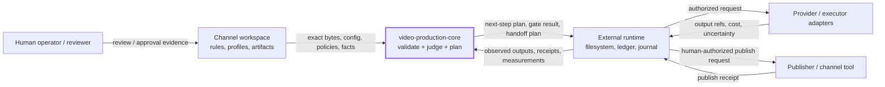
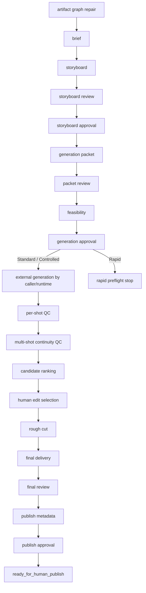
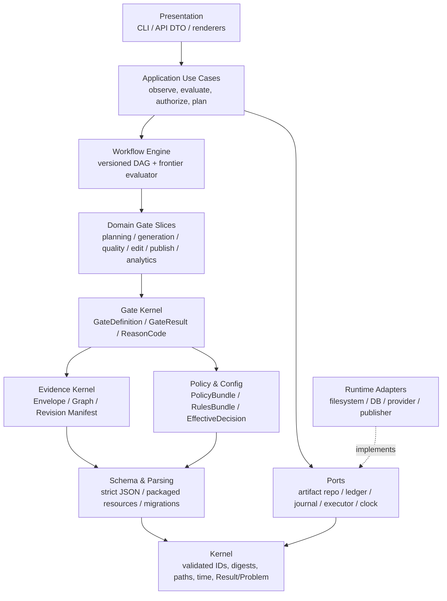
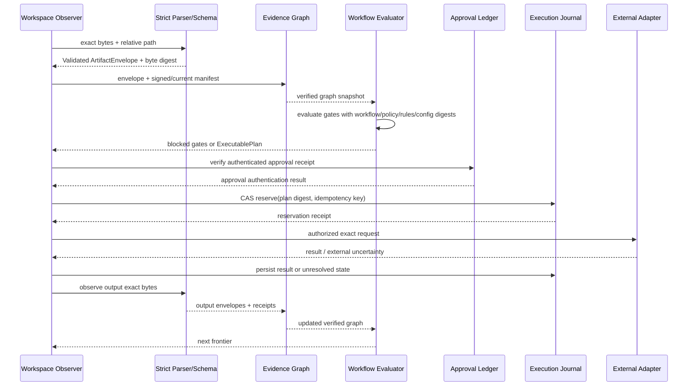

# video-production-core 0.3.1 아키텍처 진단 및 재설계 기준선

- **감사일:** 2026-08-05
- **대상:** `video-production-core-main`
- **배포판/계약:** `video-production-core 0.3.1`, `core_contract 0.3`, `config_contract 1.0`
- **분석 범위:** 코드 78개 모듈·15,921 LOC, JSON Schema 46개, 테스트 38개 파일, 빌드 휠, CLI, 정적 순수성 검사
- **판정 신뢰도:** 저장소 내부 구조·계약·실행 가능한 순수 로직은 높음. 실제 채널 워크스페이스, 외부 어댑터, 승인 원장, 영속 저장소, 게시 런타임은 첨부되지 않아 운영 종단 간 동작은 별도 검증이 필요함.

---

## 1. 핵심 결론

이 저장소는 이름만 보면 “영상 제작 시스템”처럼 보이지만, 실제 정체는 **채널 중립적인 결정론적 계약·검증·계획 코어**다. 영상 생성기, 워크플로 상태 저장소, 승인 시스템, 게시 시스템이 아니다. 호출자가 관찰한 artifact snapshot과 설정·정책·측정 결과를 받아, 다음 안전한 행동과 차단 사유를 계산하는 **함수형 의사결정 커널**이다.

현재 설계의 방향은 타당하다. 특히 다음 자산은 재설계에서도 보존해야 한다.

1. 코어가 유료 생성·파일 변경·프로세스 실행·네트워크·승인·게시를 수행하지 않는 **plan-only 경계**
2. artifact를 path + SHA-256 + artifact version으로 결합하는 **증거 중심 모델**
3. 승인 요구사항과 실제 인간 승인 증거를 분리하는 **명시적 인간 게이트**
4. workflow mode 누락 시 fail-closed하고, tolerance·quota·provider limit을 임의 추정하지 않는 원칙
5. 생성 전 feasibility와 생성 후 shot/continuity QC를 나누고, serialized evidence로 재판정하는 설계
6. 순수성·부작용·저장소 격리를 자동 검사하는 테스트 자산

그러나 현재 상태를 그대로 “안전한 생산 코어”로 배포하기에는 중대한 결함이 있다.

- **배포 휠에서 schema registry가 작동하지 않는다.** 권장 설치 방식 자체가 깨져 있다.
- **승인이 현재 effective config에 대한 것인지 오케스트레이터가 확인하지 않는다.** 승인 재사용 공격 또는 stale approval 통과가 가능하다.
- caller가 주장한 hash/currentness를 생산 게이트에서 강제 검증하지 않는다.
- 1,681줄 중앙 오케스트레이터와 6개 패키지 순환 의존성이 확장을 막는다.
- 정책 선언과 실제 gate enforcement가 일부 어긋난다.
- runtime/CLI/영속 idempotency/authenticated approval은 아직 계약 조각 수준이다.

따라서 권장 전략은 **전면 재작성**이 아니라 다음과 같은 단계적 재구성이다.

> 기존 pure core와 327개 characterization test를 보존한 채, `strict schema → verified evidence → unified gate → declarative workflow → durable runtime` 순서로 경계를 재정의하고 구·신 evaluator를 일정 기간 병렬 실행한다.

---

## 2. 감사 방법과 확인된 사실

| 영역 | 수행 내용 | 결과 |
|---|---|---|
| 저장소 구조 | 전체 Python 모듈 AST, import, 함수·클래스·LOC, schema registry 조사 | 78 모듈, 22 top-level package, 15,921 LOC |
| 계약 | README, CONTRACTS, 46개 schema, public re-export 조사 | 등록 artifact version 42개, family 37개 |
| 동작 | unit/integration/compatibility 전체 테스트 실행 | 327 passed, 2 Windows-only skipped |
| 순수성 | core purity, side-effect-free, repo isolation 검사 | 세 검사 모두 PASS |
| 커버리지 | branch-aware coverage 측정 | 총 78.04%, statement 83.54%, branch 62.37% |
| 배포 | wheel 빌드·내용 검사·격리 설치 후 schema registry 호출 | wheel 내 schema 0개, 설치본 registry 실패 |
| 입력 경계 | missing path, invalid date, NaN, duplicate key 실험 | crash 또는 잘못된 pass 재현 |
| 승인 경계 | 서로 다른 effective config hash로 readiness 평가 | 두 경우 모두 `ready=True` 재현 |
| 파일 경계 | root 밖을 가리키는 symlink로 init/export plan 평가 | 두 계획 모두 `READY` 재현 |
| 의존성 | package-level directed graph와 SCC 계산 | 6개 package 순환 결합 확인 |

테스트는 현재 Python 3.13.5에서 실행했다. 패키지가 선언한 공식 범위는 `>=3.12,<3.13`이므로, 릴리스 판정에는 반드시 Python 3.12 환경의 동일 검사가 추가되어야 한다.

---

## 3. 현행 시스템의 정확한 정체와 경계

### 3.1 시스템 컨텍스트



코어가 **소유하는 것**은 다음과 같다.

- 구조·스키마 검증
- canonical serialization/hash 계산
- config layer merge와 effective snapshot 계산
- workflow mode 및 execution mode 제한 계산
- review/approval/feasibility/QC/continuity 계약
- 입력 증거에 따른 deterministic next-step 계획
- workspace init/export/encode/dispatch에 대한 plan 또는 contract

코어가 **의도적으로 소유하지 않는 것**은 다음과 같다.

- artifact 파일 탐색, “latest” 선택, current revision 결정
- 파일 쓰기·이동·삭제·압축·인코딩 실행
- 네트워크 호출, child process, provider 결제·생성
- 인간 승인 생성 또는 진위 인증
- 상태 저장, event ledger, 재시작 복구
- 최종 clip 선택, 게시 실행

이 경계는 올바르다. 문제는 일부 public API가 외부에서 받은 사실을 **검증된 사실이 아니라 주장(assertion)**으로 신뢰하고, 그 차이를 타입과 plan에 남기지 않는다는 점이다.

### 3.2 핵심 불변식

현행 코드가 의도하는 불변식은 다음과 같이 정리할 수 있다.

1. workflow mode는 명시되어야 하며 ambient default를 사용하지 않는다.
2. core artifact는 등록된 schema를 통과해야 한다.
3. current singleton family는 정확히 1개여야 한다.
4. 한 episode observation의 artifact는 episode/rules provenance가 일치해야 한다.
5. review는 현재 subject의 exact reference에 결합되어야 한다.
6. Standard/Controlled generation은 exact artifact-bound human approval을 요구한다.
7. packet의 모든 shot은 pass/warn QC를 가져야 한다.
8. multi-shot은 각 인접 shot pair와 세 continuity axis를 모두 덮는 pass/warn continuity report가 필요하다.
9. ranking 뒤의 최종 clip 선택은 인간이 수행한다.
10. final delivery → independent review → metadata → publish approval의 lineage가 완성되어야 한다.
11. core가 반환하는 마지막 상태는 publish 실행이 아니라 `ready_for_human_publish`다.

이 중 1, 2, 3, 4, artifact hash binding 상당 부분은 구현되어 있다. 그러나 **exact observed bytes**, **current effective config**, **authenticated human evidence**, **durable external state**는 현행 오케스트레이션 불변식에 끝까지 연결되지 않는다.

---

## 4. 현행 패키지 구조

| 패키지 | 현재 책임 | 설계 평가 |
|---|---|---|
| `domain` | NewType 기반 ID/hash/path, `ArtifactReference`, migration protocol | 가장 아래 계층이어야 하나 런타임 검증이 약함 |
| `config` | 4 persisted layer, 7 merge layer, canonical hash, provenance, effective snapshot | 기능은 견고하나 engine import와 requested/effective mode 혼합 문제 |
| `artifacts` | schema discovery/registry/validation | 핵심 경계이나 package resource와 strict JSON이 부족함 |
| `engine` | mode contract, artifact graph, 전체 episode orchestration | 책임 과집중, 순환 의존성의 중심 |
| `policy` | Rapid/Standard/Controlled catalog, mode resolution, bridge | engine/provider 타입에 의존하고 일부 정책이 미집행 |
| `approvals` | requirement/evidence shape, exact binding helper | 좋은 분리이나 인증·ledger는 없음 |
| `review` | review request/result contract | 얇고 재사용 가능 |
| `providers` | provider/executor contracts, registry, guard, adapters | side-effect boundary 개념은 좋으나 durable journal이 없음 |
| `feasibility` | packet/storyboard/profile 기반 pre-generation checks | 도메인 로직이 비교적 명확함 |
| `qc` | 단일 subject 기술 QC plan/judgment | continuity와 규칙 차이, placeholder/decimal 문제 |
| `continuity` | multi-shot continuity plan/judgment/rejudgment | 현행 코드 중 가장 잘 구조화된 도메인 slice 중 하나 |
| `media` | 생성 결과 파일명·aspect matching | 순수 helper |
| `encode` | ffmpeg command plan과 post-check contract | 실행과 분리된 plan 모델은 유지 가치가 높음 |
| `storage` | frozen index, init/export plan | no-overwrite 의도는 좋으나 symlink/TOCTOU 경계 미완성 |
| `distribution` | lock/path/wheel plan | source checkout 중심 가정과 실제 wheel packaging gap |
| `brand` | entity model/catalog/projection | 채널 중립 entity contract |
| `analytics` | metric 비교와 retro 판정 | main production workflow와 아직 분리된 보조 slice |
| `sheets` | generation sheet projection | presentation artifact generator |
| `lint` | injected rule 기반 lint | 순수 검사 slice |
| `security` | purity contract/check facade | 정적 경계 검증 자산 |
| `cli` | command registry/handler/parser/recovery | library facade와 실제 shell UX가 불일치 |

### 4.1 패키지 의존성 문제

확인된 강결합 컴포넌트(SCC)는 다음 6개다.

```text
approvals → config → engine → policy → providers → approvals
                     ↘ continuity → config
```

정확한 내부 edge는 다음과 같다.

- `approvals → config`
- `config → engine`
- `continuity → config`
- `engine → config, continuity, policy`
- `policy → engine, providers`
- `providers → approvals, engine`

이는 단순 import 스타일 문제가 아니다. `ExecutionMode`, `WorkflowMode`, digest, approval, policy decision 같은 **핵심 개념의 소유권이 여러 패키지에 흩어져 있음**을 의미한다.

---

## 5. artifact 계약과 현재 workflow

### 5.1 계약 규모

- schema 파일: 46개
- registry에 등록되는 artifact version: 42개
- artifact family: 37개
- orchestrator `PipelineKind`: 17개 family

즉, registry family 중 약 절반은 현재 episode next-step pipeline의 직접 노드가 아니다. analytics, idea pipeline, references, handoff, config, generation-day brief, reservation 등은 독립 도메인 또는 향후 runtime 경계에 남아 있다.

### 5.2 현행 gate 흐름



이 흐름은 narrative planning부터 publish release까지 중요한 lineage를 잘 드러낸다. 다만 코드에서는 이 전체 흐름이 `plan_next_step()`의 순차 `if` 체인으로 구현되어 있어, workflow 정의·gate 평가·사람 안내 문구·plan identity가 한 모듈에 뒤섞여 있다.

### 5.3 workflow mode와 execution mode

두 축은 개념적으로 분리되어 있다.

- **WorkflowMode:** Rapid / Standard / Controlled — review, approval, audit strictness
- **ExecutionMode:** preview_only / human_only / automated — adapter 실행 상한

이 분리는 올바르다. 그러나 config merge가 requested mode를 effective mode로 덮어쓰기 때문에 감사 가능한 결정 모델은 충분하지 않다.

권장 표현은 다음과 같다.

```text
requested_execution_mode
channel_maximum
workflow_mode_maximum
adapter_maximum
kill_switch_maximum
effective_execution_mode
reasons[]
```

---

## 6. 검증 결과와 품질 기준선

### 6.1 통과한 검증

- 전체 테스트: **327 passed, 2 skipped**
- `check_core_purity.py`: PASS, 265 files, 0 violations
- `check_side_effect_free.py`: PASS, 78 files, 0 violations
- `check_repo_isolation.py`: PASS, 131 files, 0 violations
- statement coverage: **83.54%**
- branch coverage: **62.37%**

이는 다음을 뜻한다.

- 현재 동작을 보호할 characterization 기반이 충분히 크다.
- pure-core 경계는 문서 선언만이 아니라 정적 검사로도 상당 부분 지켜진다.
- 재설계 시 기존 코드를 버리기보다 adapter/facade로 감싸고 parity test를 만들 수 있다.

### 6.2 신뢰도가 낮은 경계

| 모듈 | branch-aware combined coverage | 의미 |
|---|---:|---|
| `cli/main.py` | 8.1% | 실제 shell parser/dispatch가 거의 검증되지 않음 |
| `providers/enforcement.py` | 61.1% | 승인·실행 직전 보안 경계에 분기 공백 |
| `providers/adapters.py` | 62.6% | uncertainty/reconcile 경로에 공백 |
| `qc/plan.py` | 68.5% | 측정 타입·중복·직렬화 경계 공백 |
| `approvals/requirements.py` | 69.3% | requirement/evidence parsing·binding 공백 |
| `cli/handlers.py` | 71.2% | library facade와 shell wiring 간 공백 |
| `engine/orchestration.py` | 77.7% | 전체 수치는 높지만 branch 124개가 미검증 |

테스트 개수만으로는 패키징·설치·CLI·실제 lineage 신뢰도를 판단할 수 없다. 현재 integration test는 1개이며 config merge, validate/doctor, retry ledger를 확인할 뿐 전체 production lineage를 검증하지 않는다.

---

## 7. 상세 결함 목록

### 심각도 정의

- **P0:** 안전한 배포 또는 승인 신뢰 모델을 즉시 깨뜨리는 차단 결함
- **P1:** 운영 전 해결해야 하는 구조·보안·정합성 결함
- **P2:** 확장성·거버넌스·성능·명확성 개선 사항

확인된 결함은 **P0 2건, P1 15건, P2 2건**이다.

### P0-001 — 배포 휠에 JSON Schema 리소스가 포함되지 않음

- **상태:** `confirmed`
- **영향:** README가 권장하는 검증된 휠 설치 방식에서 핵심 artifact 검증 기능이 작동하지 않는다.
- **근거:**
  - pyproject.toml:21-25에는 src 패키지 탐색만 있고 schema package-data 설정이 없음
  - 빌드된 wheel 83개 엔트리 중 *.schema.json 0개
  - 설치본 get_default_registry()가 ArtifactSchemaError를 발생시킴
  - src/video_factory/artifacts/registry.py:47-61이 소스 체크아웃 상대 경로를 전제함
- **재설계 조치:** schema를 패키지 리소스로 이동하고 importlib.resources 기반 로딩, wheel-install E2E 및 manifest 검사를 추가한다.

### P0-002 — 오케스트레이션 승인 게이트가 현재 effective-config 해시를 검증하지 않음

- **상태:** `confirmed`
- **영향:** 이전 또는 다른 설정으로 발급된 승인 증거가 현재 생성/게시 게이트를 통과할 수 있다.
- **근거:**
  - approval schema/도메인에는 effective_config_sha256가 존재함
  - providers/enforcement.py:41-56은 request와 승인 requirement의 config hash를 비교함
  - engine/orchestration.py:315-361의 _approval_blockers는 version/state/capability/bound_artifacts만 비교함
  - 서로 다른 임의 config hash(c*64, d*64)를 넣은 두 실험 모두 generation readiness ready=True
- **재설계 조치:** 모든 gate evaluation context에 CurrentEffectiveConfigRef를 필수화하고 승인·plan identity에 exact hash를 포함한다.

### P1-001 — ArtifactSnapshot이 호출자 주장 해시와 current 플래그를 신뢰함

- **상태:** `confirmed`
- **영향:** 구조상 유효한 거짓 digest/current assertion이 lineage와 승인 결합의 신뢰 루트가 될 수 있다.
- **근거:**
  - artifact_graph.py:142-167은 sha256가 주어지면 문서/바이트와의 일치 여부를 검증하지 않음
  - artifact_graph.py:200-216은 envelope의 sha256와 is_current를 그대로 수용함
  - exact byte helper는 존재하지만 생산 게이트에서 강제되지 않음
- **재설계 조치:** verification_state와 digest_kind를 가진 EvidenceEnvelope를 도입하고 생산 승인은 VERIFIED_BYTES + manifest-current만 허용한다.

### P1-002 — Artifact JSON 파싱/스키마 검증이 엄격하지 않고 오류 경계가 불안정함

- **상태:** `confirmed`
- **영향:** 유효하지 않은 증거가 통과하거나, 정상적인 입력 오류가 구조화된 실패 대신 예외로 누출된다.
- **근거:**
  - validation.py:95-106은 FormatChecker 없이 validator를 생성함
  - invalid date-time, NaN metric, duplicate JSON key가 모두 ok=True
  - 존재하지 않는 Path는 validation.py:164-175에서 source 미할당으로 UnboundLocalError
  - str 입력이 존재하는 경로인지 JSON text인지 모호하게 분기됨
- **재설계 조치:** strict decoder(중복 키/비유한 수/UTF-8/깊이·크기 제한), FormatChecker, 명시적 validate_bytes/path/mapping API를 만든다.

### P1-003 — 1,681줄 단일 오케스트레이터에 정책·증거·도메인 판단이 집중됨

- **상태:** `confirmed`
- **영향:** 정책 변경과 artifact 추가가 중앙 분기문 변경으로 이어지고, 누락·드리프트·회귀 위험이 커진다.
- **근거:**
  - engine/orchestration.py는 저장소 최대 모듈이며 plan_next_step이 긴 순차 분기 구조
  - PipelineKind는 17 family만 포함하지만 registry에는 37 family가 존재함
  - create_generation_packet 안내는 최신 2.1 지원과 달리 2.0을 하드코딩함
  - plan id는 workflow/policy/rules/effective-config digest를 포함하지 않음
- **재설계 조치:** versioned declarative workflow DAG + gate catalog + generic evaluator로 치환하고 레거시 evaluator와 dual-run한다.

### P1-004 — 패키지 의존성에 6개 패키지 순환 결합이 존재함

- **상태:** `confirmed`
- **영향:** 핵심 타입의 소유권이 불분명하고 독립 테스트·재사용·패키지 분리가 어려워진다.
- **근거:**
  - SCC: approvals, config, continuity, engine, policy, providers
  - 대표 역방향: config→engine, policy→engine/providers, providers→approvals/engine, engine→config/continuity/policy
- **재설계 조치:** kernel→schema/evidence/policy/gates→workflow→application→ports/adapters의 단방향 규칙을 도입하고 architecture test로 강제한다.

### P1-005 — 정책 카탈로그의 일부 필드와 실제 게이트 동작이 일치하지 않음

- **상태:** `confirmed`
- **영향:** 정책 문서/코드/실제 gate가 서로 다른 보안·검수 수준을 약속한다.
- **근거:**
  - Controlled의 STAGE_BRIEF=HUMAN이지만 orchestrator는 brief review를 평가하지 않고 storyboard로 진행함
  - Standard 주석은 storyboard peer review를 optional로 설명하지만 구현은 1건을 요구함
  - allows_capability_downgrade_mid_run은 선언만 있고 실행 경로에서 사용되지 않음
  - immutable_audit_log_required와 author separation은 제한된 위치에서만 소비됨
- **재설계 조치:** PolicyBundle을 버전·해시 결합하고 모든 필드에 enforcement matrix 및 conformance test를 둔다.

### P1-006 — 요청 execution mode와 계산된 effective mode가 같은 필드로 덮어써짐

- **상태:** `confirmed`
- **영향:** 감사 시 사용자의 요청, 정책 상한, 실제 결정값을 명확히 분리하기 어렵다.
- **근거:**
  - config/merge.py:336-355가 settings.execution.mode를 effective_mode로 치환함
  - 원 요청값과 변환 사유는 constraints 문자열에만 간접 보존됨
  - leaf provenance는 원 source를 가리키지만 실제 값은 merge 후 정책 계산으로 변환됨
- **재설계 조치:** requested_execution_mode, effective_execution_mode, decision_limits/reasons/provenance를 별도 필드로 보존한다.

### P1-007 — CLI가 내부 기능을 실제 입력 인터페이스로 노출하지 못하며 상태 표기가 과장됨

- **상태:** `confirmed`
- **영향:** 사용자는 명령이 운영 가능한 것으로 오해할 수 있고 자동화 계약이 불안정하다.
- **근거:**
  - run/status CLI는 artifact_docs=()를 전달함
  - qc는 expectations=None, approve/review는 항상 usage_error
  - registry는 이 명령들을 IMPLEMENTED로 표시함
  - main은 --json을 검사하지만 parser에는 옵션이 없어 doctor --json exit=2
  - cli/main.py branch-aware coverage 8.1%
- **재설계 조치:** stdin/--input/--output/--json, 안정 exit code, JSON result envelope을 도입하고 library-only 명령은 명확히 분류한다.

### P1-008 — Executor 불확실 상태와 idempotency lock이 프로세스 메모리에만 존재함

- **상태:** `confirmed`
- **영향:** 재시작·다중 인스턴스·중복 dispatch 상황에서 비용이 드는 외부 작업을 안전하게 조정할 수 없다.
- **근거:**
  - providers/adapters.py:313-424의 _unresolved는 인메모리 dict
  - 프로세스 재시작 시 미해결 외부 상태가 사라짐
  - observe/reconcile은 immutable request fingerprint를 검증하지 않음
- **재설계 조치:** durable ExecutionJournalPort와 CAS 기반 상태기계, request digest, reconciliation receipt를 도입한다.

### P1-009 — 승인 증거는 구조적으로만 유효하며 진위가 인증되지 않음

- **상태:** `confirmed`
- **영향:** schema-valid assertion과 실제 사람이 승인한 인증 증거를 구분할 수 없다.
- **근거:**
  - ApprovalEvidence.record_sha256는 단순 필드이며 serialized record 또는 signature와 대조되지 않음
  - approved_by_human=true는 caller-supplied document data
  - immutable audit ledger receipt/signature contract가 없음
- **재설계 조치:** authentication_state, ledger receipt/signature verification port를 도입하고 Controlled gate는 인증된 evidence만 허용한다.

### P1-010 — ArtifactGraph가 일반적인 lineage graph라기보다 검증된 snapshot 집합에 가까움

- **상태:** `confirmed`
- **영향:** artifact family가 늘수록 참조 검증이 중복되고 stale lineage를 일관되게 탐지하기 어렵다.
- **근거:**
  - family/one/matches 조회 중심이며 edge extraction·cycle·supersession/revision 모델이 없음
  - 각 artifact의 참조 결합은 orchestrator helper에서 수동 검증됨
  - currentness는 외부 boolean assertion에 의존함
- **재설계 조치:** typed EvidenceGraph, edge registry, subject/revision index, CurrentManifest, generic lineage query를 만든다.

### P1-011 — Review/Feasibility/QC/Continuity/Approval의 verdict와 증거 규칙이 분절됨

- **상태:** `confirmed`
- **영향:** 동일 의미의 gate가 서로 다른 실패 의미·정밀도·중복 처리 규칙을 가진다.
- **근거:**
  - review pass/fail/uncertain, feasibility pass/fail/inconclusive, QC 5상태, approval granted/rejected 등 상이
  - QC는 duplicate measurement id를 last-win 처리하지만 continuity는 reject
  - QC equality가 문자열 coercion을 하고 Decimal을 float로 직렬화함
  - artifact 미지정 시 unspecified/zero-hash placeholder를 생성함
- **재설계 조치:** 공통 GateResult/ReasonCode/Status algebra와 typed quantity, exact decimal serialization, strict duplicate rule을 도입한다.

### P1-012 — 스키마 검증과 도메인 값 검증이 분리되어 invalid typed value가 생성 가능함

- **상태:** `confirmed`
- **영향:** 검증을 거치지 않은 값도 타입상 정상처럼 core 내부로 유입될 수 있다.
- **근거:**
  - domain/contracts.py의 ID·Hash·Path가 NewType(str)라 런타임 검증을 제공하지 않음
  - constructor와 schema/semantic helper 사이에 중복 검증이 존재함
- **재설계 조치:** 파싱 경계에서 validated immutable value object를 생성하고 gate는 Validated[T]만 받도록 한다.

### P1-013 — 최종 결과물 QC가 shot-qc family와 final-output 가상 shot으로 모델링됨

- **상태:** `confirmed`
- **영향:** shot scope와 assembled delivery scope의 품질 규칙·측정치를 명확히 분리하기 어렵다.
- **근거:**
  - orchestration.py:1576-1600은 final-delivery.technical_qc_ref를 shot-qc family에서 찾음
  - 테스트는 shot_id=final-output을 사용함
- **재설계 조치:** subject_scope를 명시하거나 delivery-qc/media-qc 계약을 별도로 도입한다.

### P1-014 — workspace plan이 symlink escape와 계획-실행 간 TOCTOU를 막지 못함

- **상태:** `confirmed`
- **영향:** 외부 실행기가 계획을 신뢰하면 root 밖 정보 노출 또는 승인된 계획과 다른 바이트 실행이 가능하다.
- **근거:**
  - workspace_init/export의 rglob + is_file이 root 밖 target을 가리키는 symlink를 포함함
  - 실험에서 init/export 모두 READY이며 외부 파일 link.txt가 계획에 포함됨
  - plan 생성 후 실행 전 source bytes가 바뀌어도 executor-side revalidation contract가 없음
- **재설계 조치:** no-follow traversal, resolved containment, file type policy, exact input digest 재검증을 가진 ExecutablePlan/Receipt를 도입한다.

### P1-015 — 테스트 수는 많지만 전체 생산 lineage와 설치 경계 통합 검증이 부족함

- **상태:** `confirmed`
- **영향:** 소스 체크아웃 단위 테스트가 통과해도 배포 및 종단 간 신뢰 경계가 깨질 수 있다.
- **근거:**
  - 327 tests 중 integration test는 1개
  - 해당 test는 config merge/CLI validate/doctor/retry ledger를 다루고 전체 episode lineage는 다루지 않음
  - installed-wheel schema/CLI E2E가 없어 P0 packaging 결함을 발견하지 못함
  - 총 branch coverage 62.37%; 핵심 경계 모듈 일부는 8~69%
- **재설계 조치:** wheel-installed E2E, full synthetic workflow, property/mutation, architecture, dual-evaluator parity test를 추가한다.

### P2-001 — ADR·CI·migration·release governance가 코드 성장 속도를 따라가지 못함

- **상태:** `confirmed`
- **영향:** 설계 의도·호환성·릴리스 판정이 사람 기억과 문서 조각에 의존한다.
- **근거:**
  - 코드/문서가 ADR-001/003/004/006을 참조하지만 ADR 파일이 저장소에 없음
  - CI 설정, installed-wheel matrix, reproducible build 검사가 없음
  - migrate CLI는 NOT_YET_BACKED인데 artifact major/minor 버전은 누적 중
  - Python 3.12 전용 지원 선언이나 현재 감사 환경 3.13에서만 전체 suite 실행됨
- **재설계 조치:** ADR 보관소, contract compatibility policy, Python 3.12/Windows/Linux CI, reproducible wheel, migration registry를 구축한다.

### P2-002 — 성능·DoS·API 명확성 하드닝 여지가 남아 있음

- **상태:** `confirmed`
- **영향:** 대규모 입력·확장된 provider 구성·공개 API 진화에서 비용과 혼란이 증가한다.
- **근거:**
  - schema registry/validator를 반복 생성하며 compiled cache가 없음
  - 입력 크기·깊이·파일 수 제한이 없음
  - provider registry가 capability 하나당 단일 binding 중심
  - public Transition API와 plan-only 불변식 사이에 의미 중복이 존재함
- **재설계 조치:** resource limits/cache, provider identity key, API deprecation map, semver compatibility rule을 명시한다.

---

## 8. 근본 원인

개별 버그보다 중요한 근본 원인은 다음 다섯 가지다.

### 8.1 “계약은 엄격하지만 관찰 경계는 약한” 비대칭

schema와 dataclass는 엄격한 모양을 요구하지만, 그 document가 실제 관찰한 bytes인지, current인지, 사람이 인증한 것인지는 외부 주장으로 남는다. 결과적으로 **구조적 유효성**과 **증거 신뢰성**이 같은 타입 안에서 구분되지 않는다.

### 8.2 소스 체크아웃을 정상 실행 환경으로 암묵 가정

schema discovery, doctor, 일부 repository 검사가 source tree 상대 경로를 사용한다. 그러나 README의 운영 지침은 verified wheel 설치를 권장한다. 개발 환경과 배포 환경의 계약이 반대 방향이다.

### 8.3 기능을 추가할 때 중앙 오케스트레이터를 확장하는 성장 방식

새 family와 gate가 생길 때 declarative definition 또는 plugin을 추가하는 대신 `orchestration.py`에 helper와 분기를 추가했다. 이 때문에 policy drift와 plan ID 누락이 발생한다.

### 8.4 safety logic이 여러 계층에 분산

config, policy bridge, orchestration, provider enforcement, approval helper가 서로 다른 수준에서 비슷한 결합 검사를 수행한다. 올바른 검사도 존재하지만 모든 진입점에서 동일하게 적용되지 않는다.

### 8.5 runtime을 의도적으로 제외했지만 실행 계약은 끝까지 완결하지 않음

plan-only는 올바른 결정이다. 그러나 plan을 외부에서 안전하게 실행하려면 exact input digest, expiry, allowed outputs, execution journal, receipt, reconciliation이 필요하다. 현재는 “실행하지 않는다”와 “안전하게 실행될 수 있는 계획을 만든다” 사이의 마지막 계약이 부족하다.

---

## 9. 재설계 목표와 비목표

### 9.1 목표

1. exact bytes, current revision, policy/config, human approval을 하나의 검증 가능한 신뢰 사슬로 연결한다.
2. workflow를 코드 분기문이 아닌 버전·해시 가능한 데이터 정의로 만든다.
3. 모든 gate가 공통 status/reason/evidence envelope을 사용한다.
4. core pure planner와 side-effect runtime 사이에 executable plan/receipt 계약을 둔다.
5. package dependency를 단방향으로 만들고 architecture test로 고정한다.
6. wheel 설치본이 source checkout 없이 완전하게 작동하게 한다.
7. 기존 0.3 계약과 결과를 dual-run/parity 방식으로 안전하게 이행한다.
8. 채널·콘셉트·에피소드 특화 정보는 여전히 외부 owner data로 유지한다.

### 9.2 비목표

- 코어가 직접 AI 영상 생성 provider를 호출하도록 만드는 것
- 코어가 자동 승인 또는 자동 게시 권한을 갖도록 만드는 것
- 특정 채널, 캐릭터, 영상 길이, provider 한도를 core schema에 하드코딩하는 것
- 모든 기능을 microservice로 분리하는 것
- 기존 42개 artifact contract를 한 번에 폐기하는 것

---

## 10. 목표 아키텍처

### 10.1 논리 계층



**의존성 규칙:** 위쪽은 아래쪽만 import한다. `kernel`, `schema`, `evidence`, `policy`는 `engine`, `CLI`, adapter를 import하지 않는다.

### 10.2 권장 배포 단위

초기에는 **하나의 monorepo**를 유지하되 내부 경계를 엄격히 한다. 안정화 후 필요할 때 다음 네 distribution으로 분리할 수 있다.

1. `video_factory_contracts`
   - validated value object
   - strict JSON/canonicalization
   - packaged schema catalog
   - artifact compatibility/migration registry

2. `video_factory_planner`
   - evidence graph
   - policy/gate kernel
   - declarative workflow evaluator
   - domain gate plugins
   - side-effect free

3. `video_factory_runtime`
   - ports/application services
   - durable journal/ledger
   - exact-byte observer
   - executable plan runner
   - adapter integrations

4. `video_factory_cli`
   - stdin/file JSON interface
   - human-readable/JSON rendering
   - stable exit codes
   - domain logic 없음

지금 즉시 네 저장소나 네 서비스로 나누는 것은 권장하지 않는다. 먼저 package cycle을 제거하고 public contract를 안정화해야 한다.

---

## 11. 핵심 계약 재설계

### 11.1 ArtifactReference와 digest 의미 분리

현재 `sha256`는 exact file bytes hash인지 canonical document hash인지 타입만 보고 구분할 수 없다. 다음과 같이 분리한다.

```text
Digest:
  algorithm: sha256
  value: 64-hex
  kind: EXACT_BYTES | CANONICAL_JSON | CONTENT_DERIVED
```

생산 승인과 외부 실행에는 `EXACT_BYTES`만 허용한다. 테스트·in-memory draft에는 `CANONICAL_JSON`을 허용하되 production authorization과 명확히 분리한다.

### 11.2 EvidenceEnvelope

```yaml
artifact_ref:
  path: 04_prompts/generation_packet.json
  digest:
    algorithm: sha256
    kind: EXACT_BYTES
    value: "..."
  artifact_version: generation-packet/2.1
verification_state: VERIFIED_BYTES
schema_state: VALID
semantic_state: VALID
authentication_state: UNAUTHENTICATED
parser_profile: strict-json-v1
subject:
  workspace_id: workspace-a
  channel_id: channel-a
  concept_id: concept-a
  episode_id: ep-001
revision:
  revision_id: rev-007
  ordinal: 7
  supersedes_ref: "..."
observed_at: 2026-08-05T00:00:00Z
observer_id: runtime:workspace-observer
```

권장 상태 구분:

- `verification_state`: VERIFIED_BYTES / SYNTHETIC_CANONICAL / ASSERTED
- `authentication_state`: UNAUTHENTICATED / LEDGER_VERIFIED / SIGNATURE_VERIFIED
- `currentness`: manifest에서 계산하며 envelope의 임의 boolean로 받지 않음

### 11.3 CurrentManifest

```yaml
manifest_version: current-manifest/1.0
scope: {episode_id: ep-001}
entries:
  - family: generation-packet
    subject_key: ep-001
    current_ref: "..."
    revision_id: rev-007
    supersedes: "..."
manifest_digest: "..."
```

`current`는 caller boolean이 아니라, exact hash-bound manifest와 revision rule로 계산한다.

### 11.4 GateResult 공통 대수

```yaml
gate_id: generation.approval
gate_version: 1.0
subject_ref: "..."
status: PASS   # PASS | WARN | FAIL | INCONCLUSIVE | NOT_APPLICABLE
reason_codes:
  - APPROVAL_CONFIG_MATCH
consumed_evidence_refs: ["..."]
produced_claims:
  - generation_authorized
context_digests:
  workflow: "..."
  policy: "..."
  rules: "..."
  effective_config: "..."
diagnostics: []
```

사람이 읽는 메시지는 reason code의 presentation이다. plan ID에는 메시지 문자열이 아니라 stable reason code와 version digest를 넣는다.

### 11.5 PolicyBundle과 RulesBundle

```yaml
policy_bundle_version: policy-bundle/1.0
policy_id: standard-2026-08
workflow_mode: standard
review_requirements: {...}
approval_requirements: {...}
audit_requirements: {...}
execution_limits: {...}
bundle_digest: "..."
```

모든 정책 필드는 다음 중 하나여야 한다.

- gate evaluator가 직접 소비함
- runtime authorization이 소비함
- 명시적으로 informational이며 readiness에는 영향 없음

어느 코드도 소비하지 않는 보안 필드는 허용하지 않는다. 이를 enforcement matrix test로 검증한다.

### 11.6 EffectiveExecutionDecision

```yaml
requested_mode: automated
limits:
  channel: human_only
  workflow: human_only
  adapter: automated
  kill_switch: automated
effective_mode: human_only
reason_codes:
  - CHANNEL_MAXIMUM_APPLIED
source_refs: ["..."]
decision_digest: "..."
```

요청값을 덮어쓰지 않고 결정 artifact로 보존한다.

### 11.7 Declarative WorkflowDefinition

```yaml
workflow_version: episode-production/1.0
nodes:
  storyboard:
    requires: [brief.current]
    gates: [storyboard.schema, storyboard.review, storyboard.approval]
    on_blocked: review_or_revise_storyboard
  generation:
    requires: [generation_packet.current]
    gates: [packet.review, feasibility.complete, generation.approval]
    on_pass: external_generation_handoff
workflow_digest: "..."
```

Evaluator는 긴 단일 `if` 체인 대신 다음을 계산한다.

- 현재 충족된 claims
- 차단 중인 모든 gate
- 실행 가능한 action frontier
- 정책상 추천 action
- action의 exact input/context digest

초기 호환 모드에서는 frontier 중 우선순위가 가장 높은 한 action만 기존 `next-step/1.0` 형태로 projection한다.

### 11.8 NextStepPlan identity

새 plan digest에는 최소한 다음이 들어가야 한다.

```text
workflow_definition_digest
policy_bundle_digest
rules_bundle_digest
effective_config_digest
current_manifest_digest
evidence_graph_digest
action_definition_version
stable blocker reason codes
```

사람 안내 문구 변경만으로 plan identity가 바뀌어서는 안 되고, 정책 의미가 바뀌었는데 plan identity가 유지되어서도 안 된다.

### 11.9 ExecutablePlan / ExecutionReceipt

```yaml
plan_id: plan-...
plan_digest: "..."
capability_id: cap.media.generate
adapter_constraints: {...}
input_refs: [exact-byte refs]
allowed_outputs: [...]
policy_context: {...}
idempotency_key: "..."
expires_at: "..."
preconditions: [...]
```

외부 executor는 실행 직전에 input hash, current manifest, config/policy digest, approval authentication을 재검증하고 다음 receipt를 반환한다.

```yaml
receipt_id: receipt-...
plan_digest: "..."
request_digest: "..."
outcome: SUCCEEDED | FAILED | EXTERNAL_UNCERTAIN
output_refs: [...]
measured_cost: {...}
started_at: "..."
completed_at: "..."
executor_id: "..."
```

### 11.10 Durable execution journal

권장 상태기계:

```text
PLANNED
  → AUTHORIZED
  → RESERVED
  → DISPATCHING
  → SUCCEEDED | FAILED | EXTERNAL_UNCERTAIN
  → RECONCILED
```

- CAS/optimistic concurrency로 전이
- unique key: `(adapter_id, capability_id, idempotency_key)`
- 같은 key라도 request digest가 다르면 hard reject
- 재시작 후에도 unresolved state 유지
- reconciliation도 exact request/plan digest에 결합

---

## 12. 목표 실행 흐름



---

## 13. 권장 디렉터리 구조

```text
src/video_factory/
  kernel/
    ids.py
    digest.py
    paths.py
    time.py
    decimal.py
    result.py
  schema/
    resources/schemas/
    catalog.py
    strict_json.py
    validation.py
    compatibility.py
    migration.py
  evidence/
    envelope.py
    revision.py
    manifest.py
    graph.py
    edges.py
  policy/
    bundles.py
    execution_decision.py
    enforcement_matrix.py
  gates/
    contracts.py
    evaluator.py
    reason_codes.py
  domains/
    planning/
    generation/
    quality/
    editing/
    publishing/
    analytics/
  workflow/
    definitions/
    compiler.py
    evaluator.py
    projection.py
  application/
    observe_episode.py
    evaluate_episode.py
    build_approval.py
    authorize_plan.py
  ports/
    artifact_repository.py
    byte_observer.py
    approval_ledger.py
    execution_journal.py
    plan_executor.py
    clock.py
  adapters/       # runtime distribution에서만 포함 가능
  presentation/
    cli/
```

기존 import 경로는 compatibility facade로 유지하고 deprecation window를 둔다.

---

## 14. 단계적 마이그레이션 계획

### Phase 0 — 생산 차단 결함 안정화

목표: 아키텍처 변경 전에 현재 0.3의 배포·신뢰 경계를 정상화한다.

1. schema를 package resource로 이동하고 `importlib.resources`로 로드
2. wheel contents manifest와 격리 설치 E2E 추가
3. `validate_artifact` missing path crash 수정
4. strict JSON decoder와 `FormatChecker` 적용
5. generation/publish readiness에 current effective config ref/hash 필수화
6. CLI `--json` 또는 해당 분기 제거 후 일관된 parser 계약 확정
7. Python 3.12 Linux/Windows CI 추가
8. ADR 원문 또는 새 ADR set을 저장소에 체크인

**종료 기준:** 설치한 wheel만으로 42개 schema version이 모두 로드되고, wrong-config approval이 모든 gate에서 fail한다.

### Phase 1 — Kernel / Schema 재구성

1. `kernel` value objects 도입
2. exact-byte digest와 canonical digest 타입 분리
3. 명시적 `parse_bytes`, `parse_path`, `validate_mapping` API
4. validator/catalog cache와 input resource limit
5. requested/effective mode 분리
6. 기존 public API는 facade로 새 구현 호출

### Phase 2 — Evidence 신뢰 모델

1. `ArtifactSnapshot`을 `ArtifactEnvelope`로 감싸는 adapter 작성
2. verification/authentication/currentness 상태 도입
3. `CurrentManifest`와 revision/supersession 모델
4. generic edge extractor와 lineage validation
5. production gate에서 ASSERTED/SYNTHETIC evidence 금지

### Phase 3 — Gate 통합

1. 공통 `GateStatus`, `GateResult`, `ReasonCode`
2. review, approval, feasibility, QC, continuity를 adapter로 연결
3. duplicate measurement hard reject
4. typed quantities와 exact decimal serialization
5. placeholder artifact 제거
6. delivery QC scope 분리

### Phase 4 — Declarative Workflow

1. 현행 동작을 `episode-production/legacy-0.3` 정의로 인코딩
2. old/new evaluator를 같은 fixture에 dual-run
3. plan/action/blocker parity report 생성
4. 누락된 brief review 정책을 구현하거나 policy contract에서 명시적으로 제거
5. policy enforcement matrix와 architecture tests 추가
6. 모든 plan에 workflow/policy/rules/config/evidence digests 포함

### Phase 5 — Runtime / CLI

1. durable execution journal port + reference adapter
2. authenticated approval ledger port
3. executable plan/receipt와 executor-side revalidation
4. no-follow filesystem adapter와 TOCTOU 방어
5. stdin/JSON 기반 실제 CLI 인터페이스
6. installed wheel 기준 doctor

### Phase 6 — Contract 1.0 전환

1. 레거시 orchestrator deprecate
2. package cycle 0 보장
3. artifact migration registry와 compatibility window
4. old schema projection 및 migration tooling
5. reproducible build와 signed schema manifest

---

## 15. 마이그레이션 안전 전략

### 15.1 Strangler + dual-run

새 evaluator를 즉시 주 경로로 바꾸지 않는다.

```text
same EvidenceGraph
  ├─ legacy evaluator → LegacyPlan
  └─ new evaluator    → NewPlan
                         ↓
                    parity comparator
```

비교 대상:

- action type
- approval requirement
- blockers의 stable reason code
- consumed artifact refs
- next phase/procedure
- prohibited action
- context digests

문구 차이는 허용하되 의미 차이는 명시적으로 승인해야 한다.

### 15.2 compatibility facade

- 기존 `video_factory.engine.plan_next_step()`는 새 application service를 호출
- 기존 `ArtifactSnapshot`은 `verification_state=SYNTHETIC_CANONICAL` 또는 `ASSERTED`로 변환
- production authorization API만 VERIFIED_BYTES를 필수화
- 기존 schema version은 읽되 새 persistence는 최신 version으로만 작성

### 15.3 schema migration 원칙

- patch: 의미 불변, backward compatible
- minor: optional field 추가, 기존 reader 허용
- major: explicit migration required
- migration output은 새 path/hash를 갖고 source를 overwrite하지 않음
- migration receipt에 source/target/schema/compiler/core version을 결합

---

## 16. 수용 기준

### 배포

- [ ] 격리 설치한 wheel에서 42개 등록 schema가 모두 조회됨
- [ ] wheel에 schema manifest와 모든 resource가 포함됨
- [ ] Python 3.12 Linux/Windows에서 test/CLI smoke 통과
- [ ] 동일 source에서 재현 가능한 wheel hash 또는 차이 설명 가능

### 입력과 증거

- [ ] duplicate key, NaN/Infinity, invalid UTF-8, invalid date-time 거부
- [ ] size/depth/file-count limit이 설정 가능하고 fail-closed
- [ ] production gate는 VERIFIED_BYTES만 허용
- [ ] currentness는 signed/hash-bound manifest에서 계산
- [ ] wrong policy/rules/config digest에 결합된 승인 항상 거부
- [ ] authenticated와 merely schema-valid approval을 구분

### 아키텍처

- [ ] package dependency SCC 0개
- [ ] domain/planner가 CLI/runtime adapter를 import하지 않음
- [ ] workflow definition이 version/digest를 가짐
- [ ] 정책의 모든 보안 필드가 enforcement matrix에 매핑됨
- [ ] plan identity가 의미 있는 context digest를 모두 포함

### 런타임 안전

- [ ] unresolved external state가 재시작 후 유지됨
- [ ] same idempotency key + different request digest hard reject
- [ ] executor가 실행 직전 exact input과 approval context를 재검증
- [ ] output은 allowed path/version/hash contract를 통과해야 receipt 확정
- [ ] symlink root escape와 plan/execute TOCTOU를 차단

### 테스트

- [ ] full synthetic episode lineage E2E
- [ ] wheel-installed CLI E2E
- [ ] old/new evaluator parity corpus
- [ ] hash/currentness/config mutation tests
- [ ] artifact order property test
- [ ] duplicate/stale/ref-cycle/supersession property tests
- [ ] schema/evidence/policy/workflow/runtime safety 경계 branch coverage 90% 이상

---

## 17. 첫 번째 구현 백로그

다음 순서가 가장 안전하고 투자 대비 효과가 높다.

| 우선순위 | 작업 | 완료 산출물 |
|---:|---|---|
| 1 | wheel schema packaging 수정 | packaged resources, manifest, installed-wheel test |
| 2 | strict JSON/validation 경계 수정 | strict decoder, format checking, typed error tests |
| 3 | effective config 승인 결합 | GateContext + wrong-config regression test |
| 4 | plan identity context 확장 | plan schema vNext와 digest tests |
| 5 | package dependency rule 도입 | architecture test, kernel type relocation plan |
| 6 | EvidenceEnvelope/CurrentManifest 설계 | ADR + contracts + legacy adapter |
| 7 | GateResult/ReasonCode 통합 | review/QC/approval adapter prototype |
| 8 | legacy workflow를 declarative definition으로 복제 | compiler/evaluator + parity report |
| 9 | durable journal/reference runtime | SQLite 또는 owner-selected store adapter |
| 10 | 실제 CLI JSON 인터페이스 | stdin/file/output/exit-code E2E |

P0 두 항목이 해결되기 전에는 현재 0.3.1을 production authorization의 최종 신뢰 지점으로 사용하지 않는 것이 안전하다.

---

## 18. 작성해야 할 ADR

1. **ADR-001 — Pure planner와 side-effect runtime의 경계**
2. **ADR-002 — Exact byte digest와 canonical document digest의 의미**
3. **ADR-003 — Artifact revision/current manifest 모델**
4. **ADR-004 — Approval authentication과 effective-config binding**
5. **ADR-005 — WorkflowDefinition 및 GateResult 모델**
6. **ADR-006 — WorkflowMode와 ExecutionMode 결정 체계**
7. **ADR-007 — Durable idempotency / external uncertainty state machine**
8. **ADR-008 — Schema packaging, compatibility, migration policy**
9. **ADR-009 — Filesystem containment와 executable plan receipt**
10. **ADR-010 — Monorepo 내부 계층과 향후 distribution split 기준**

기존 코드가 참조하는 ADR 번호와 충돌할 수 있으므로, 원 ADR을 복원할 수 없다면 `legacy-reference` 표와 함께 새 번호 체계를 확정해야 한다.

---

## 19. 추가로 결정해야 하는 설계 쟁점

재설계를 시작할 때 다음은 임의로 구현하지 말고 명시적 결정 기록이 필요하다.

1. **승인 인증 방식:** append-only DB receipt, digital signature, 외부 identity provider 중 무엇을 신뢰 루트로 둘지
2. **current manifest 소유자:** workspace runtime, 중앙 artifact repository, 또는 ledger 중 누가 current revision을 결정할지
3. **workflow definition 형식:** Python DSL, JSON/YAML data, 또는 compiled hybrid
4. **runtime persistence:** SQLite reference adapter를 core repo에 둘지, port만 둘지
5. **policy bundle 배포:** workspace 소유 data인지 signed package resource인지
6. **artifact major migration 책임:** core migrator, workspace tool, 별도 migration distribution 중 어디에 둘지
7. **CLI의 역할:** 사람용 diagnostic shell인지 automation-stable API client인지

이 문서의 기본 권고는 다음과 같다.

- workflow definition은 **typed Python compiler + canonical JSON compiled form**의 hybrid
- runtime persistence는 core에는 port, reference runtime에는 SQLite adapter
- approval은 최소 ledger receipt 검증, Controlled는 서명 또는 강한 identity evidence
- current manifest는 workspace runtime이 작성하되 hash-bound ledger에 기록
- CLI는 stable JSON automation surface를 우선하고 human rendering을 projection으로 제공

---

## 20. 최종 판단

`video-production-core`는 실패한 설계가 아니다. 오히려 **부작용 없는 계획 코어, 인간 승인 분리, exact artifact binding, 생성 후 continuity 재판정**이라는 중요한 방향을 이미 확보했다. 문제는 contract 수가 늘어나는 동안 다음 네 경계가 완결되지 않았다는 데 있다.

1. source checkout과 실제 wheel 배포 경계
2. 구조적 validation과 검증된 evidence 경계
3. policy 선언과 모든 gate의 일관된 enforcement 경계
4. pure plan과 durable/secure execution runtime 경계

따라서 재설계의 중심 질문은 “영상 제작 기능을 더 넣을 것인가”가 아니다.

> **어떤 사실을 누가 관찰했고, 어떤 bytes·revision·policy·config·승인에 결합되었으며, 그 증거로 어떤 행동을 안전하게 허용할 것인가?**

이 질문을 `EvidenceEnvelope → GateResult → WorkflowDefinition → ExecutablePlan/Receipt`의 네 계약으로 고정하면, 현재 코어의 장점을 잃지 않고 채널별 워크스페이스와 다양한 AI 생성 도구를 안전하게 확장할 수 있다.

---

## 부록 A. 등록 artifact version

- `analytics-record/1.0`
- `approval-requirement/1.0`
- `brand-entity/1.0`
- `brief/1.0`
- `candidate-ranking/1.0`
- `channel-config/1.0`
- `concept-config/1.0`
- `continuity-qc/1.0`
- `edit-manifest/1.0`
- `effective-config/1.0`
- `episode-config/1.0`
- `external-call-reservation/1.0`
- `final-delivery/1.0`
- `final-review/1.0`
- `generation-day-brief/1.0`
- `generation-feasibility-review/1.0`
- `generation-packet/1.0`
- `generation-packet/2.0`
- `generation-packet/2.1`
- `handoff-event/1.0`
- `handoff-result/1.0`
- `handoff-task/1.0`
- `idea-candidates/1.0`
- `idea-scorecard/1.0`
- `idea-scores/1.0`
- `next-step/1.0`
- `packet-approval/1.0`
- `packet-approval/2.0`
- `packet-review/1.0`
- `publish-approval/1.0`
- `publish-metadata-draft/1.0`
- `reference-manifest/1.0`
- `reference-review/1.0`
- `retro-report/1.0`
- `rough-cut-report/1.0`
- `shot-qc/1.0`
- `shot-qc/2.0`
- `storyboard-approval/1.0`
- `storyboard-approval/2.0`
- `storyboard-review/1.0`
- `storyboard/1.0`
- `workspace-config/1.0`

## 부록 B. 분석 범위 밖

다음은 저장소에 없으므로 이번 감사에서 실제 동작을 확정하지 않았다.

- 실제 채널 rules/policy/profile 내용과 버전 관리 방식
- 파일을 관찰해 snapshot을 만드는 workspace implementation
- 실제 human approval UI/identity/ledger
- provider별 adapter와 비용·quota source
- ffmpeg/ffprobe 등 measurement runner
- 영속 artifact repository와 event store
- 게시 API/계정 권한/receipt
- 운영 모니터링·alert·backup·disaster recovery

이 영역은 목표 runtime 설계 이후 별도 operational architecture review가 필요하다.
